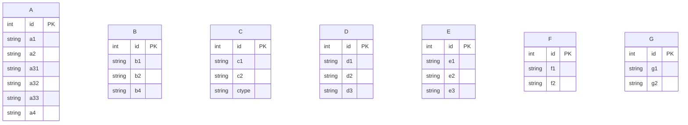
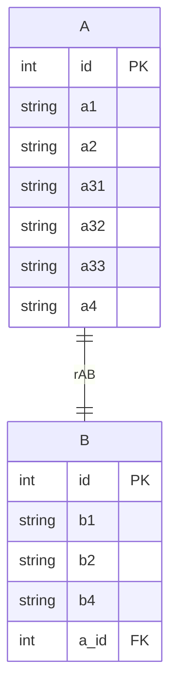
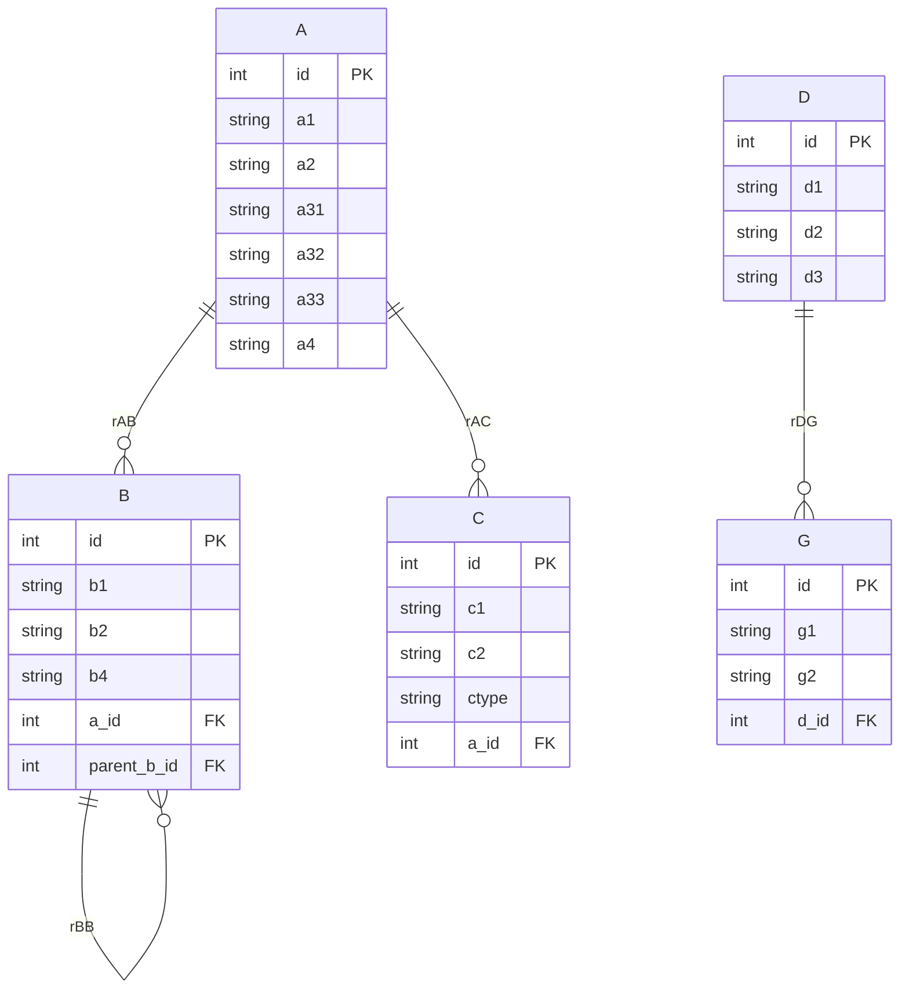
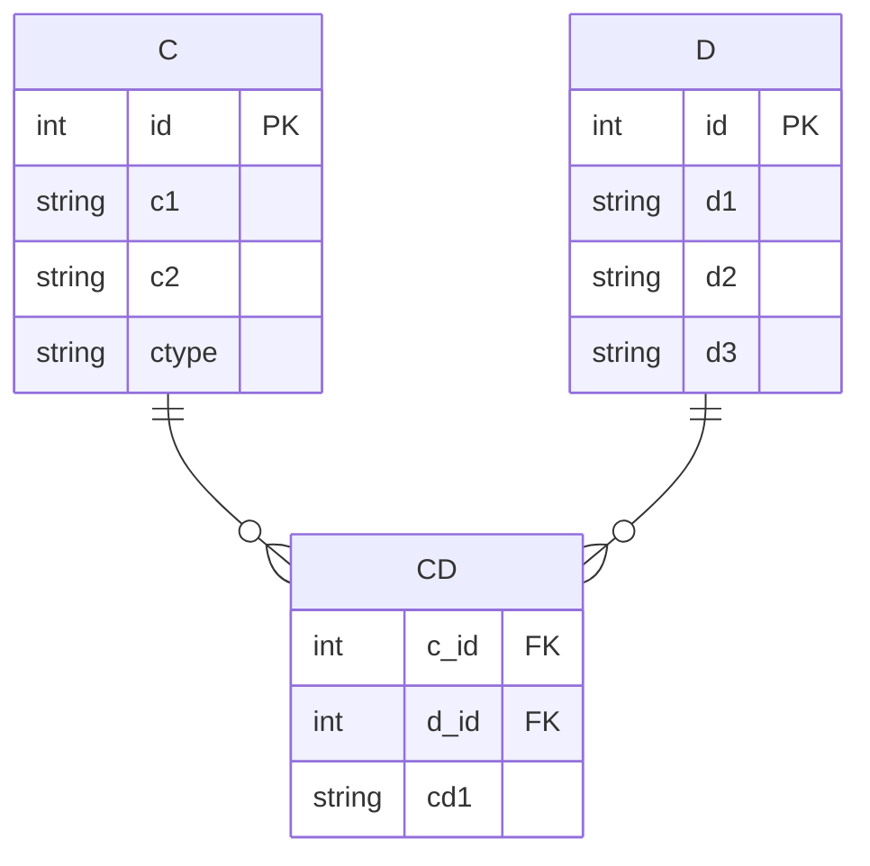
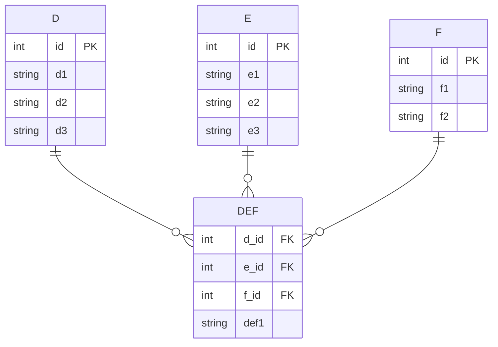
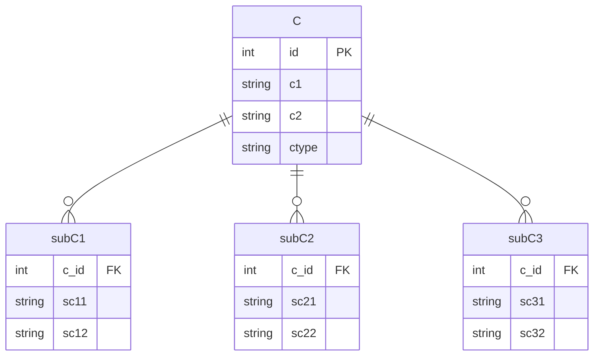

# Transforming ER Diagram to Relational Model

## Objectives
- Transform the given Entity Relationship Diagram to a relational model step by step

## Instructions
1. From the given ER diagram, use 8-step transformation to create a relational model.
   Note: you must show the step-by-step transformation
2. Submit by the end of the class

Given the following ER diagram, use 8-step transformation to create a relational model, including:

1. Transform regular entities including simple and composite attributes
2. Transform weak entities
3. Transform binary 1:1 relationship
4. Transform binary 1:M relationship
5. Transform binary M:N relationship
6. Transform multivalued attributes
7. Transform N-ary relationship
8. Transform specialization or generalization

***Note***: If some steps are not applicable, i.e., no such entities, attributes, or relationships in the ERD, please specify "**Not applicable**"

## Step-by-Step Transformation

### 1. Transform regular entities including simple and composite attributes

Explanation:
- Entities A, B, C, D, E, F, and G are transformed into separate tables
- All attributes are converted into columns in their respective tables
- The composite attribute a3 of entity A is broken down into sub-columns (a31, a32, a33)
- Optional attributes (b3, c3) are not included as they are represented by dashed lines in the original diagram

### 2. Transform weak entities

**Not applicable** - There are no weak entities in this diagram

### 3. Transform binary 1:1 relationship

Explanation:
- The 1:1 relationship (rAB) between A and B is transformed by adding a foreign key (a_id) in table B
- We choose to add the foreign key in table B as this relationship might be optional from B to A

### 4. Transform binary 1:M relationship

Explanation:
- The 1:M relationship (rAC) between A and C is transformed by adding a foreign key (a_id) in table C
- The recursive 1:M relationship (rBB) in table B is transformed by adding a foreign key (parent_b_id) referencing itself
- The 1:M relationship (rDG) between D and G is transformed by adding a foreign key (d_id) in table G

### 5. Transform binary M:N relationship

Explanation:
- The M:N relationship (rCD) between C and D is transformed by creating a new table CD
- Table CD has foreign keys (c_id and d_id) referencing tables C and D respectively
- The relationship attribute (cd1) is added to the CD table

### 6. Transform multivalued attributes

**Not applicable** - There are no multivalued attributes in this diagram

### 7. Transform N-ary relationship

Explanation:
- The N-ary relationship (rDEF) between D, E, and F is transformed by creating a new table DEF
- Table DEF has foreign keys (d_id, e_id, and f_id) referencing tables D, E, and F respectively
- The relationship attribute (def1) is added to the DEF table

### 8. Transform specialization or generalization

Explanation:
- The specialization of entity C into subC1, subC2, and subC3 is transformed using the Multiple Table Inheritance approach
- Separate tables are created for each subclass (subC1, subC2, subC3)
- Each subclass table has a foreign key (c_id) referencing table C
- Specific attributes of each subclass are stored in their respective subclass tables
- The ctype in table C may be used as a discriminator to indicate the type of subclass
